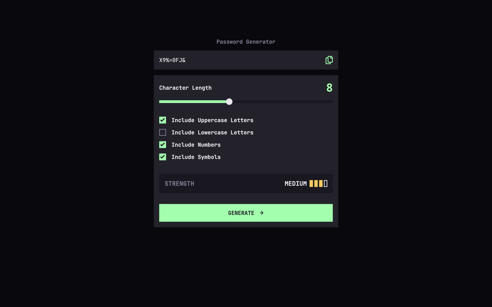
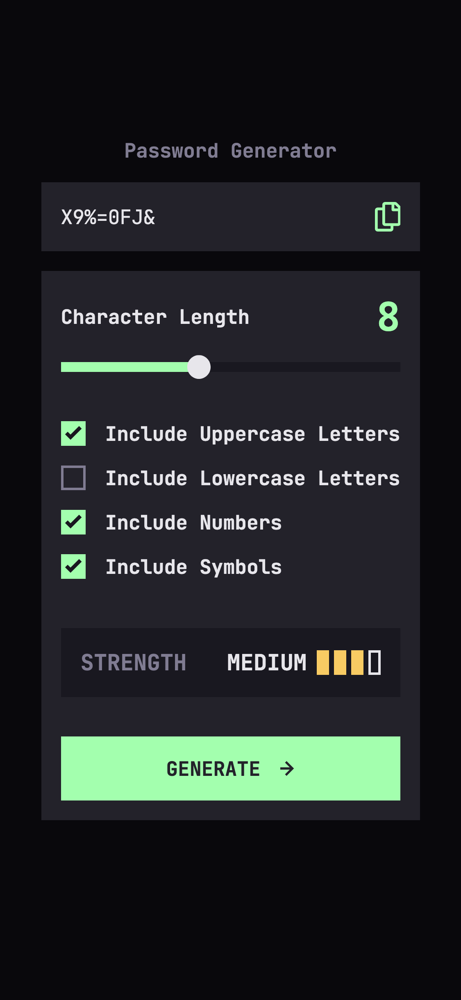

# Frontend Mentor - Password generator app solution

This is a solution to the [Password generator app challenge on Frontend Mentor](https://www.frontendmentor.io/challenges/password-generator-app-Mr8CLycqjh). Frontend Mentor challenges help you improve your coding skills by building realistic projects.

## Table of contents

- [Frontend Mentor - Password generator app solution](#frontend-mentor---password-generator-app-solution)
  - [Table of contents](#table-of-contents)
  - [Overview](#overview)
    - [The challenge](#the-challenge)
    - [Screenshot](#screenshot)
    - [Links](#links)
  - [My process](#my-process)
    - [Built with](#built-with)
    - [What I learned](#what-i-learned)
    - [Continued development](#continued-development)
    - [Useful resources](#useful-resources)
  - [Author](#author)

## Overview

### The challenge

Users should be able to:

- Generate a password based on the selected inclusion options
- Copy the generated password to the computer's clipboard
- See a strength rating for their generated password
- View the optimal layout for the interface depending on their device's screen size
- See hover and focus states for all interactive elements on the page

### Screenshot

**Desktop**

**Mobile**

### Links

- Solution URL: [GitHub Pages](https://kmulqueen.github.io/password-generator/)

## My process

### Built with

- [TypeScript](https://www.typescriptlang.org/)
- [React](https://reactjs.org/) - JS library
- [Vite](https://vite.dev/) - Frontend build tool
- [Tailwind CSS](https://tailwindcss.com/) - For styles
- Mobile-first workflow
- Semantic HTML5 markup
- CSS custom properties
- Flexbox
- CSS Grid

### What I learned

- **Custom Form Control Styling:** Implemented complex CSS techniques to style range sliders with progress tracking and custom checkboxes with SVG icons while maintaining accessibility.
- **Advanced CSS Selectors:** Used pseudo-elements like `::before`, `::after`, `::-webkit-slider-thumb`, and `::-moz-range-track` to create custom form controls across different browsers.

- **React Accessibility Patterns:** Implemented keyboard navigation (tab focus, space activation) for custom form controls and used ARIA attributes (`aria-hidden`, `role="presentation"`) for screen reader compatibility.

- **TypeScript with React:** Created strongly-typed components with interfaces and type definitions for props, improving code reliability and developer experience.

- **CSS Variables and Linear Gradients:** Used dynamic CSS variables (`--progress-percentage`) with linear gradients to create visual feedback in the range slider.

- **Form Data Processing:** Extracted and processed FormData from a form submission to generate passwords based on user-selected criteria.

### Continued development

- **Password Security Algorithms:** Continue learning about password strength assessment algorithms to provide more accurate feedback to users.
- **CSS Architecture:** Further explore best practices for organizing CSS with Tailwind, particularly for custom component styling.

- **Advanced TypeScript Patterns:** Implement more sophisticated type definitions for complex state management in React applications.

### Useful resources

- [CSS-Tricks: Styling Cross-Browser Compatible Range Inputs](https://css-tricks.com/styling-cross-browser-compatible-range-inputs-css/) - Helpful for understanding the complexities of styling range inputs across different browsers.

- [MDN Web Docs: Accessibility](https://developer.mozilla.org/en-US/docs/Web/Accessibility) - Guide on implementing accessible web components, particularly helpful for custom form controls.

- [TypeScript React Cheatsheet](https://react-typescript-cheatsheet.netlify.app/) - Quick reference for TypeScript patterns in React components.

## Author

- Website - [Kyle Mulqueen](https://github.com/kmulqueen)
- Frontend Mentor - [@kmulqueen](https://www.frontendmentor.io/profile/kmulqueen)
